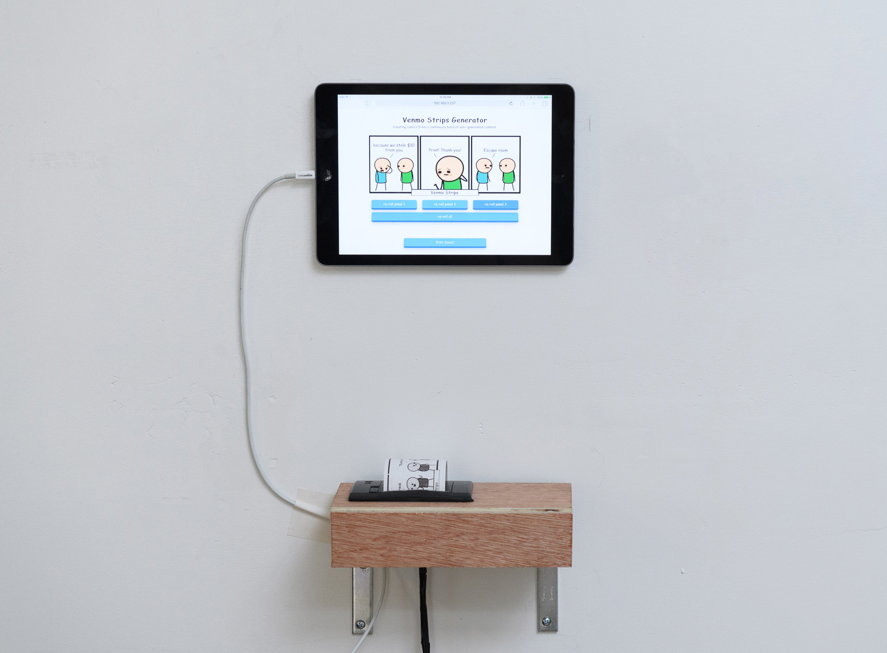

# Venmo Comic Generator

Creates three panel comics by combining most recent venmo transactions with Cyanide and Happiness panels. Finished comics can be printed on receipt paper.

### Setup
install all dependencies: `npm install`

run node server: `node server.js`

start webpack dev: `npm start`

navigate to `localhost:9000`

### Printing comics

Created to print using a Raspberry Pi 2, with the [Adafruit Mini Thermal Receipt Printer](https://www.adafruit.com/product/597). **This printer only works with Raspberry Pi 2, not 3**.

Find the Raspberry Pi IP address using `ifconfig`

In `./public/index.html`, change `RASPBERRY_PI_IP` to equal the IP of your Pi.

Follow [this guide](https://learn.adafruit.com/networked-thermal-printer-using-cups-and-raspberry-pi/connect-and-configure-printer) to set up the receipt printer with Raspberry Pi 2.

Once set up, on the Raspberry Pi 2 run `PI=true node printer.js`.

Cross fingers, and try printing from the web app.

### Examples

Created by visitors at the SFPC exhibit:

Originally exhibited at the [SFPC](http://sfpc.io/) Final Showcase

### Deploying 

Running on S3 bucket.
`aws s3 sync build s3://${aws_s3_bucket} --region ${aws_s3_region} --delete --acl public-read --profile ${aws_s3_profile}`
